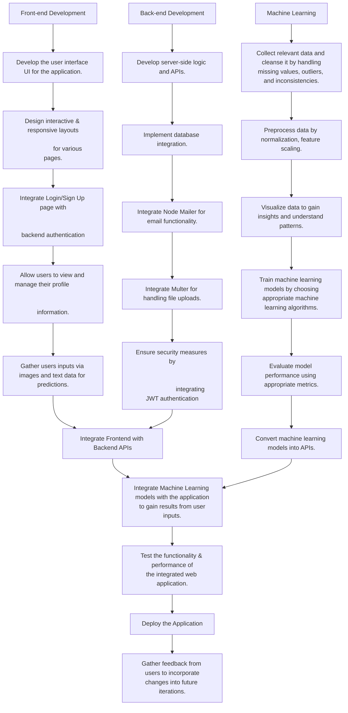

```mermaid
flowchart TD;
    A[Front-end Development]-->B[Develop the user interface UI for the application.]-->C[Design interactive & responsive layouts
                                                              for various pages.]-->D[Integrate Login/Sign Up page with
                                                                                        backend authentication]-->E[Allow users to view and manage their profile                                                                                                 information.]-->F[Gather users inputs via images and text data for predictions.]-->Y


    
    G[Back-end Development]-->H[Develop server-side logic and APIs.]-->I[Implement database integration.]
    I-->J[Integrate Node Mailer for email functionality.]-->K[Integrate Multer for handling file uploads.]-->L[Ensure security measures by
                                                                                                              integrating JWT authentication]-->Y[Integrate Frontend with Backend APIs]-->Z[Integrate Machine Learning models with the application
 to gain results from user inputs.]-->M[Test the functionality & performance of
the integrated web application.]-->O[Deploy the Application]-->N[Gather feedback from users to incorporate
changes into future iterations.]


    P[Machine Learning]-->Q[Collect relevant data and cleanse it by handling
missing values, outliers, and inconsistencies.]-->R[Preprocess data by normalization, feature scaling.]-->S[Visualize data to gain insights and understand patterns.]
    S-->T[Train machine learning models by choosing
appropriate machine learning algorithms.]-->U[Evaluate model performance using appropriate metrics.]-->V[Convert machine learning models into APIs.]-->Z
```
